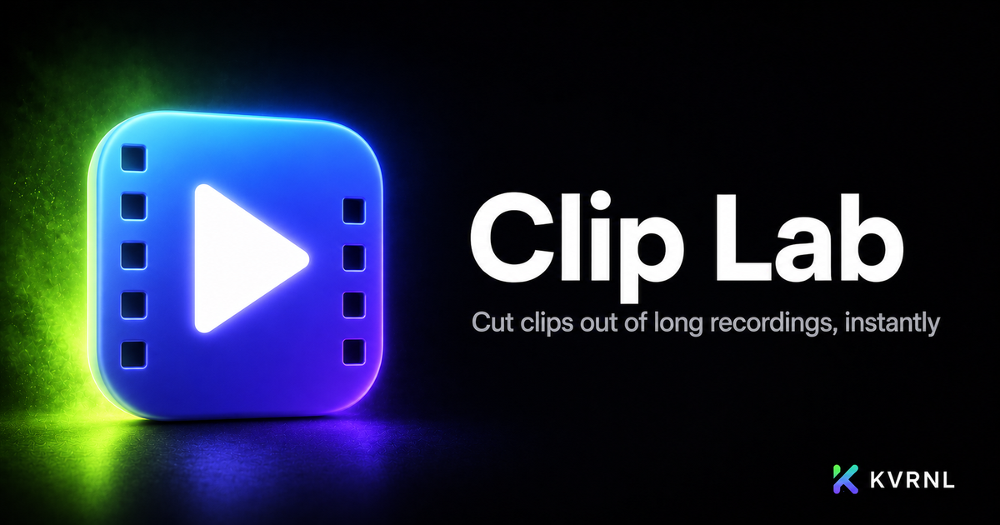

# Clip Lab

### Cut clips out of long recordings, instantly

 

Point Clip Lab at a long stream recording, mark the moments you want, and export clean clips in seconds. Instant lossless cuts or frame-perfect exports — nothing to set up.

### **[⬇&nbsp; Download Clip Lab — free at kvrnl.io](https://kvrnl.io/products/clip-lab/)**

 

---

## What it does

Clip Lab turns hours-long recordings into shareable clips fast. Open an OBS capture (or any MP4, MKV, MOV and more), scrub to the moment, mark a Start and End, name it, and add it to the queue — then batch-export the whole list at once. Even a six-hour file opens instantly because Clip Lab reads it in place.

Leave it on instant, lossless cuts, or flip on frame-perfect mode for exact edges — it re-encodes on your GPU (NVIDIA NVENC) and falls back to your CPU automatically. Everything runs locally, and you can even run several copies at once, one per video. Free to use; claim your license key and download it straight from this page.

## Features

- **Instant, lossless cuts — or frame-perfect re-encodes**
- **GPU (NVENC) export with automatic CPU fallback**
- **Queue up many clips and batch-export in one go**
- **Huge files open instantly — nothing to install**

## Download &amp; install

Clip Lab is **completely free**. Each install needs its own license key, which you get
with a free KVRNL account.

1. Go to **[kvrnl.io/products/clip-lab/](https://kvrnl.io/products/clip-lab/)**
2. Create a free account — email verification, nothing else
3. Claim your license key — instant, no waiting
4. Download and install

> [!NOTE]
> Clip Lab isn't code-signed yet, so Windows SmartScreen may warn you on first run.
> Click **More info → Run anyway**. Code signing is on the roadmap.

## Your license key

- **Free, one per product**, issued from your KVRNL account.
- **A key activates on one machine.** The first device to activate it claims it.
- **Switching computers?** Hit **Release device** on your
  [account page](https://kvrnl.io/account/) and the key is free to use again.
- Keys are checked over HTTPS at launch. See [Privacy](#privacy).

## Requirements

- **Windows 10 or 11** (64-bit)
- A free [KVRNL account](https://kvrnl.io/signup/) for your license key

## Privacy

Clip Lab sends KVRNL only what's needed to validate your license: **the key, the
product name, and a hardware ID**. No telemetry, no analytics, no tracking, and
none of your files. Full policy: **[kvrnl.io/privacy](https://kvrnl.io/privacy/)**

## What's new

**v1.0.5** — 2026-09-25
  - The activation screen has been redesigned. It walks you through getting your free key: create a free KVRNL account, get Clip Lab for free, then copy your key from My Tools. Each step has a button that opens the right page.
  - Entering your key is easier: paste it straight from an email or web page and Clip Lab picks the key out and tidies it up, or use the new Paste button.
  - When something's wrong with your key, the screen now says exactly what happened and what to do next, for example when the key is active on another PC, was released from this one, or Clip Lab has been offline too long.
  - Clip Lab now opens instantly once it's activated, instead of waiting for the internet first. Your license is still confirmed in the background.
  - If several Clip Lab windows are waiting for a key, activating one now lets the others through as soon as you switch to them.
  - Stronger protection around activation, and dropping a file onto a Clip Lab window can no longer replace the app's screen.
  - Fixed a rare case where Clip Lab could lock again right after you re-activated it.

**v1.0.4** — 2026-09-06
  - Brand-new Settings, redesigned from the ground up with tabs: General, Export, Updates, Account, Support and About.
  - Your choices now stick between launches: arrow-key jump distance, default cut mode, GPU or CPU encoding, export quality, a default save folder, and a pattern for naming clips automatically (mix in {video}, {n}, {start}, {end} or {date}).
  - Optional: open the folder automatically when an export finishes.
  - Updates tab shows what's new in every release, live download progress, and a Restart & update button the moment one is ready. A small dot on the gear icon tells you when an update is waiting.
  - Account tab shows your license status, a masked copy of your key, and your Device ID, with one-click copy for support.
  - Bug reports can now include diagnostics (version, Windows build, encoder, Device ID) so we can help faster, and a failed export offers a Report this button that fills in the details for you.
  - Keyboard shortcuts are listed under About.

**v1.0.3** — 2026-09-05
  - Instant (lossless) exports no longer fail on files that can't be cut without re-encoding, like older WebM or FLV recordings. Clip Lab now re-encodes those clips automatically and tells you it did.
  - Frame-perfect exports of HDR or 10-bit recordings now use the GPU and produce standard MP4s that play everywhere, including phones and Discord.
  - Videos with a % or ? in the file name now load in the preview player.
  - Choosing a different video now offers to clear the clips you marked on the previous one, so old timestamps can't be applied to the wrong file.
  - Formats the preview can't play (FLV, TS, AVI) now say so instead of showing a black box. You can still type times and export.
  - Arrow keys jump 15 seconds and Space plays/pauses even right after using the scrub or volume slider.
  - A temporary server problem during a license check no longer locks you out or tells you your key is invalid.
  - The window now fits on smaller laptop screens instead of hanging off the bottom.
  - Clip Lab cleans up the temporary files each launch leaves behind, so they no longer pile up in your Temp folder.

**v1.0.2** — 2026-08-18
  - Downloads and automatic updates now come straight from KVRNL's own servers instead of a third-party host. Updates are quicker and more reliable, and nothing inside the app itself has changed.
  - If you installed this app before today, please download it once more from kvrnl.io. Older copies still look for updates at the old location and can't carry themselves across the move — this one time has to be done by hand.

**v1.0.1** — 2026-07-05
  - Fixed the app still showing its old name in the title bar and header — it now reads Clip Lab everywhere.

Full history → **[kvrnl.io/changelog/clip-lab](https://kvrnl.io/changelog/clip-lab/)**

## Documentation

Setup guides and how-tos → **[kvrnl.io/docs/clip-lab](https://kvrnl.io/docs/clip-lab/)**

## Support

> [!IMPORTANT]
> **We don't use GitHub Issues.** Report bugs from inside the app — it's the
> fastest route to us and it attaches the details we need automatically.

- 🐛 **Found a bug?** Use **Report a Problem** inside Clip Lab
- 💬 **Chat with us** → **[Discord](https://discord.gg/Ub4SdAuhu)**
- ✉️ **Anything else** → **[kvrnl.io/contact](https://kvrnl.io/contact/)**
- ❓ **FAQ** → [kvrnl.io/faq](https://kvrnl.io/faq/)

## License

**Proprietary freeware — free to use, not open source.**

This repository hosts the installer releases, documentation, and license for
Clip Lab. **The application source code is not published.** See
**[LICENSE](./LICENSE)** for the full terms.

---

 

**[kvrnl.io](https://kvrnl.io)** &nbsp;·&nbsp; **[All products](https://kvrnl.io/products/)** &nbsp;·&nbsp; **[Changelog](https://kvrnl.io/changelog/)** &nbsp;·&nbsp; **[Discord](https://discord.gg/Ub4SdAuhu)** &nbsp;·&nbsp; **[Contact](https://kvrnl.io/contact/)**

© 2026 <b>KVRNL</b> — an AI-powered software studio shipping free desktop tools.

